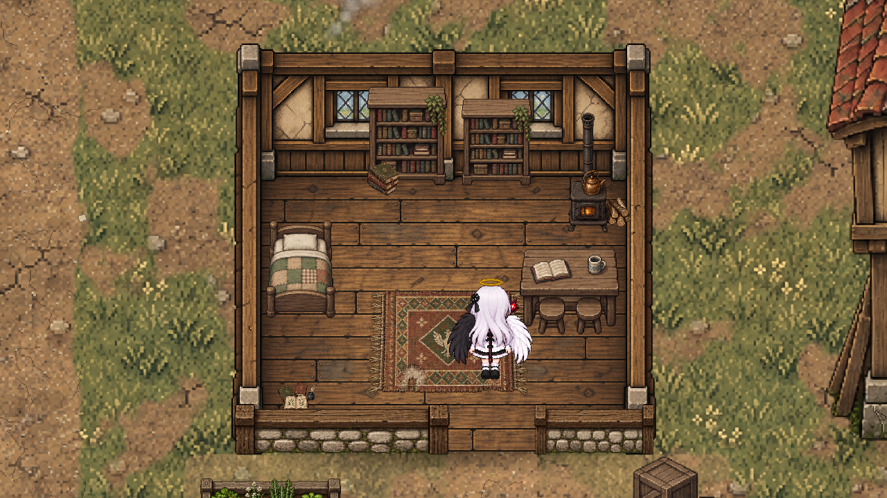
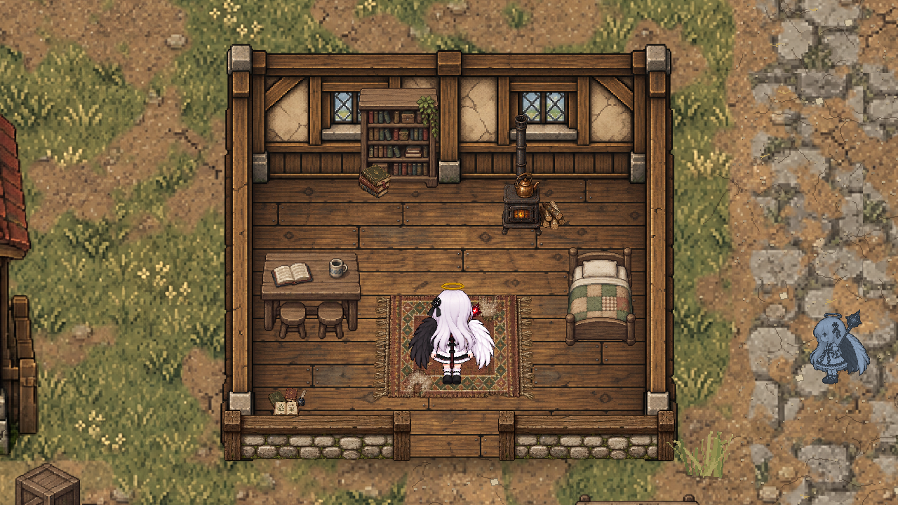

# Movimento, casas e infância — revisão RPG v4

## Testar

Execute `Builds/Bairro/Yuuki.exe`, escolha **Entrar no bairro** e use WASD/setas. Shift corre; Esc pausa. Caminhe para cima diante da porta da casa da Yuuki ou da casa vizinha do Tenebris. Para sair, volte à abertura da parede da frente e caminhe para baixo. Entre mapas, a confirmação existente foi preservada.

Sirva a raiz do projeto com `python -m http.server 8765 --bind 127.0.0.1` e abra `http://127.0.0.1:8765/preview/rpg-revision.html` para a galeria. Ela permite selecionar direção, andar/guardar/repousar, pausar e avançar um quadro; não substitui o executável para testar física.

## Arte

- 44 quadros em `Assets/Game/Resources/RpgRevision/Yuuki`: caminhada esquerda/direita com seis quadros, frente/costas com quatro, guardar cajado com três e respiração com três por direção.
- Asa anatômica esquerda preta e direita branca. As direções têm desenhos próprios, sem `flipX`.
- O cajado fica mais vertical na caminhada. Ao parar, a Yuuki o guarda nas costas, com o suporte discreto entre cabelo e asas. Ao retomar, a transição é reproduzida ao contrário antes da caminhada.
- A respiração toca os três desenhos em ordem 0–1–2–1. Não há interpolação de imagem nem suavização bilinear.
- A corrida lateral usa os quadros anteriores, preservando a corrida direita aprovada. Correr em Y usa por enquanto a caminhada vertical acelerada.
- Nove imagens de interior/porta: cômodo de madeira e reboco, tapete tecido, fogão, livros, livro aberto, parede baixa, horta e recortes das duas portas originais.

Fontes e prompts estão em `Art/Yuuki/Rpg-v4` e `Art/World/Sources/Home-v3`. `rest_up.png` é um candidato rejeitado por posicionar a gema sobre a auréola; o jogo usa `rest_up_v2.png`. O primeiro quadro de `rest_right.png`, que saiu na direção errada, foi substituído pelo segundo quadro de caminhada direita. Fontes rejeitadas não entram na reprodução.

`scripts/bairro/pack_rpg_revision.py` só recorta, limpa resíduos de transparência, dimensiona por vizinho mais próximo e alinha os pés. Não redesenha a anatomia. As células têm 512×512 px, pés na linha 400, pivô `(0.5, 112/512)` e 200 pixels por unidade no Unity. Os atlas do protótipo anterior permanecem intactos. A aprovação estética final das passadas ainda depende da revisão em movimento.

## Casas e colisões

`YuukiCutawayHouse` mantém cada interior pré-carregado na mesma cena, dentro da posição da respectiva fachada. Ao entrar, abre a folha da porta, move a personagem apenas pela soleira, remove gradualmente fachada/telhado e ativa móveis e colisores do cômodo. Ao sair, restaura a fachada e suas colisões. A câmera aproxima suavemente. Não há tela preta, carregamento de cena ou teletransporte para um cômodo distante.

Yuuki e Tenebris têm casas distintas, com mobília em disposições diferentes. Os cômodos atuais são a primeira versão dos interiores; não representam ainda todos os quartos das famílias. Foram removidos bloqueios retangulares sem correspondência visual que fechavam gramados e quintais de Rua de Casa e Moradias. Continuam sólidos os pés das construções, cercas, paredes e obstáculos visíveis.

## Cronologia

O menu e `docs/ambientacao.md` situam o começo aos nove anos. Conforme o PDF, Tenebris é filho dos vizinhos; os dois estudam juntos e frequentam a biblioteca da escola. A volta da escola e o encontro com Alice no beco são os próximos eventos narrativos a implementar. Não há ainda diálogos ou acompanhante Tenebris funcional. Os visuais atuais continuam provisórios até a criação dos sprites infantis.

## Reproduzir e validar

1. `python scripts/bairro/pack_rpg_revision.py` recompõe as imagens a partir das fontes salvas.
2. `python scripts/bairro/build_bairro.py --layouts-only` atualiza os mapas preservando a arte existente e os GUIDs. `python scripts/bairro/validate_map.py` verifica rotas, destinos, obstáculos e referências dos dois mapas.
3. No Unity 6000.0.82f1: **Yuuki > Protótipo > Reconstruir interiores e exportar**. Em batch: `-executeMethod YuukiRpgRevisionBuilder.BuildAndExport`. Reconstruir substitui as cenas geradas; os layouts são a fonte dessas cenas.
4. O executável com `--yuuki-smoke-test --smoke-output <pasta>` verifica menu, 61 peças anteriores, pausa, confirmação/cancelamento de viagem, ida e volta entre mapas, três pontos de gramado antes bloqueados, entrada/saída das duas casas na mesma cena, destino livre, animação da porta, 44 recursos de personagem, quatro direções, guardar/sacar, repouso e corrida direita preservada. Só executa com essa opção, em desenvolvimento.

As capturas dos cômodos no teste vêm de `Camera.Render` para uma textura, permitindo conferir o desenho mesmo quando a janela de teste está oculta. Não são uma sessão manual de teclado. Relatórios e capturas ficam em `Logs/smoke-rpg-final`, fora do Git.
