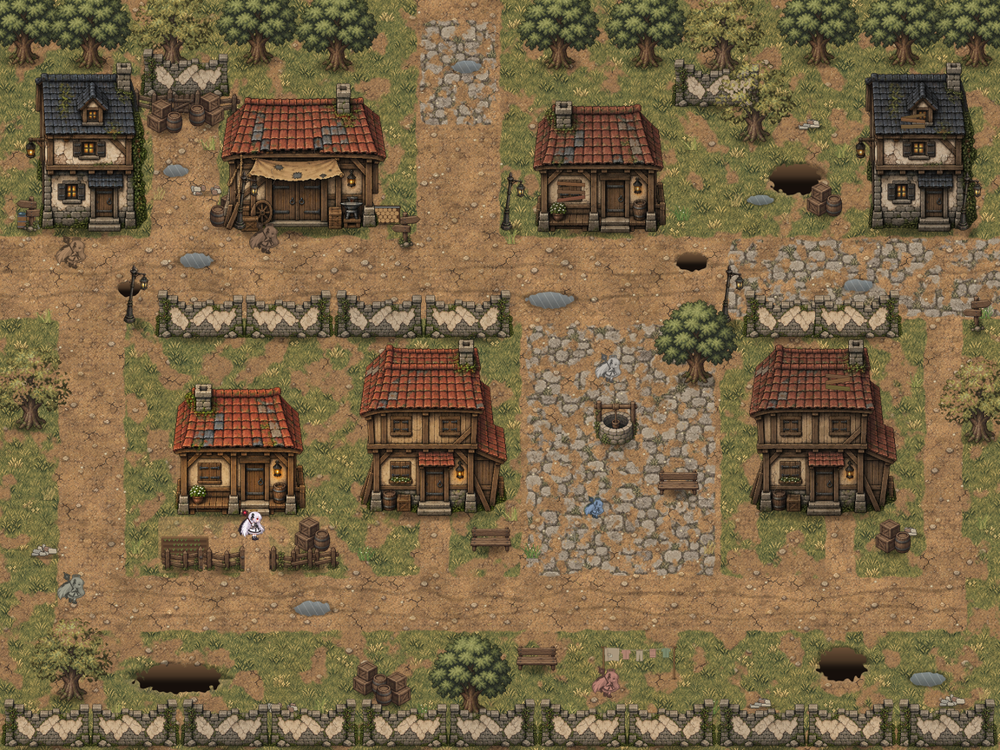
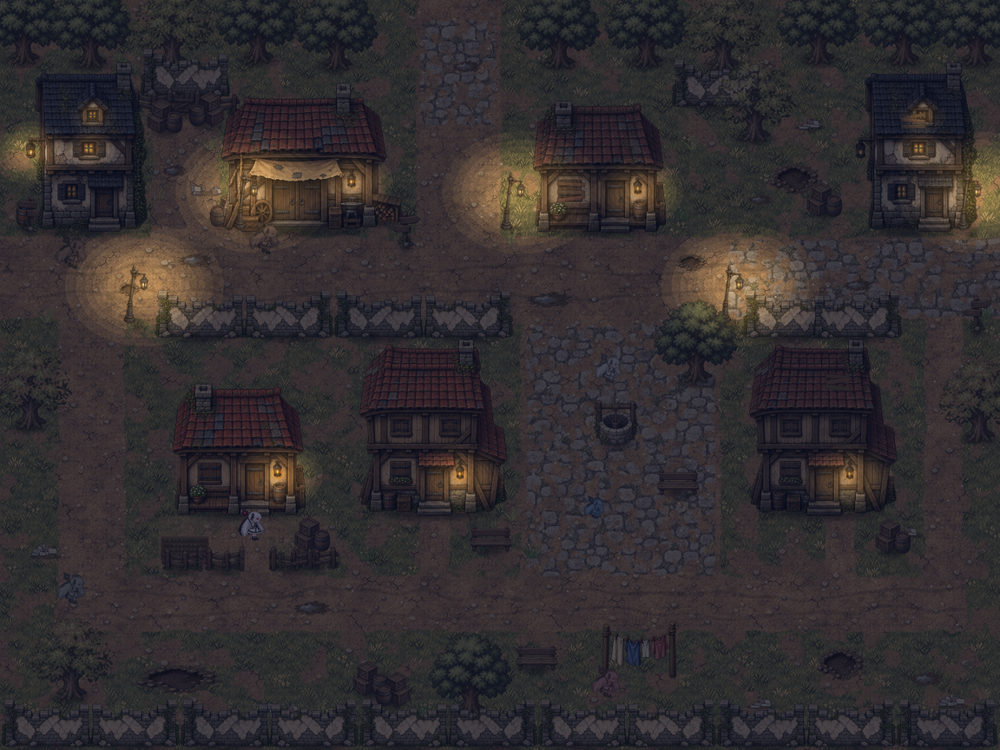
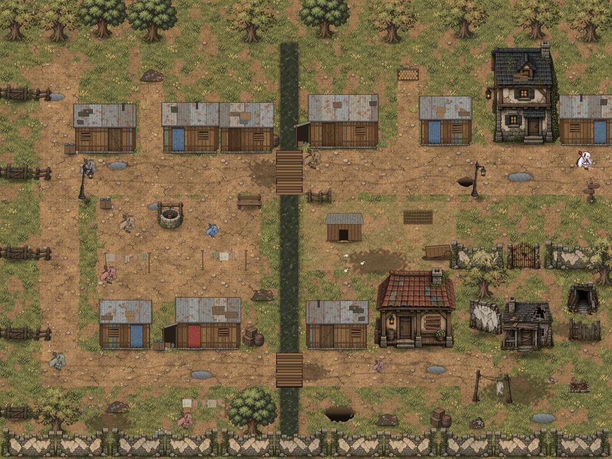
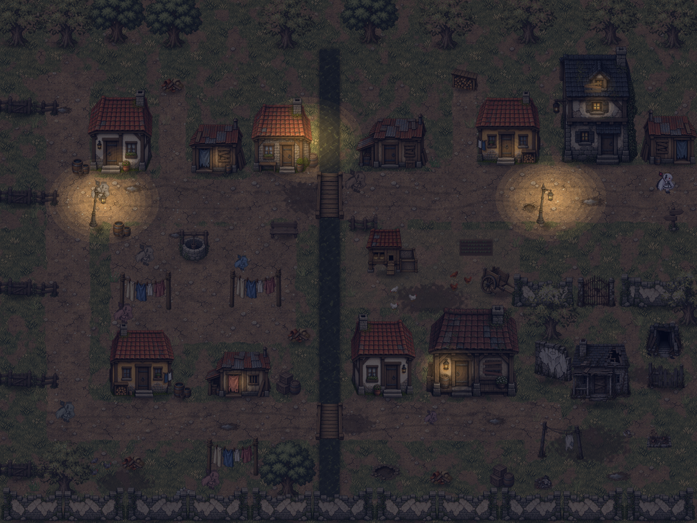
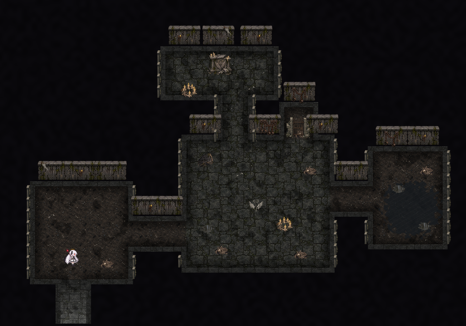
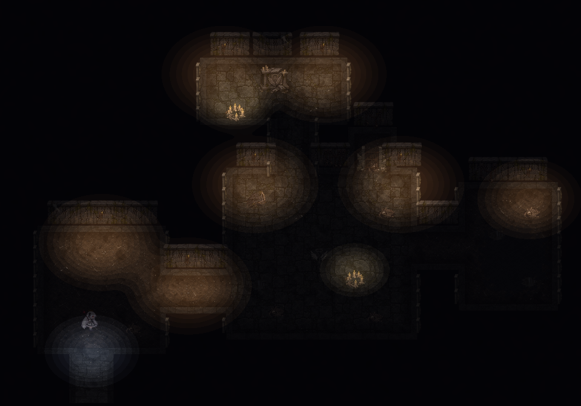

# Mapas reorganizados, dia e noite, interação e dungeon — revisão v5

## Testar

1. Abra o projeto no Unity 6000.0.82f1 e rode **Yuuki > Bairro > Construir todo o bairro**. Isso recria `Bairro_RuaDeCasa`, `Bairro_Moradias` e a nova `Bairro_Dungeon` e registra as três nas Build Settings (depois do menu).
2. Abra `Assets/Game/Scenes/Bairro_Menu.unity` e aperte Play, ou exporte com **Yuuki > Protótipo > Exportar jogo para Windows**.
3. Na versão de desenvolvimento (editor ou build Development), **T** avança 1 hora: é o jeito rápido de ver a tarde e a noite.

| Tecla | Ação |
| --- | --- |
| WASD / setas | andar |
| Shift | correr |
| F | ler placas, examinar, ver estantes e livros, descer/subir escadas |
| Esc | pausa (Retomar, Controles, Menu inicial) · fechar textos e menus |
| T | teste: +1 hora (só em desenvolvimento) |

## Prévias

| Dia | Noite |
| --- | --- |
|  |  |
|  |  |
|  |  |

As versões noturnas são calculadas pelo gerador com a mesma conta do shader, para conferir a luz sem abrir o Unity.

## Mapas mais fluidos

- **Rua de Casa**: a rua principal é o eixo, com as três saídas (Moradias a oeste, escola ao norte, comércio a leste) e uma placa em cada uma. As vielas fecham um circuito: há uma trilha nova a leste ligando a rua principal à viela de baixo. Mato, entulho, lenha e caixotes ficam encostados em muros, cercas e casas, nunca no meio do caminho. A praça do poço ganhou uma amarelinha para as crianças.
- **Moradias**: uma viela principal vem da Rua de Casa e vai estreitando para o oeste; os barracos ficam de frente para ela, com restos de quintal. A valeta divide o bairro (atravessa-se pelas pontes), a pracinha do poço é o ponto de encontro, o galinheiro fica a leste e o **canto abandonado** no sudeste.
- **Poucas placas**, em lugares com função: uma em cada saída dizendo para onde ela leva. Os marcos (poço, portão da Yuuki, fundo do beco, valeta, casa abandonada, muro riscado, brinquedo esquecido) se **examinam** com F, sem placa.

## Transição de áreas

Sem janela de confirmação. Ao pisar na borda do mapa, aparece um aviso discreto com o destino ("‹ Moradias · continue andando para seguir"). Continuar andando na direção da borda por meio segundo leva ao próximo mapa, com fade; virar para outro lado cancela sozinho. Ao chegar, o nome da área aparece no alto da tela (ex.: "MORADIAS", com "Os Subúrbios" embaixo). Áreas que ainda não existem mostram "ainda em construção".

## Dia, tarde e noite

- O relógio fica no canto superior direito: hora (de 10 em 10 minutos), dia e período (Madrugada, Manhã, Tarde, Noite), com sol ou lua. Um dia de jogo dura ~17 minutos reais (0,7 s por minuto). Começa às 07:00 do dia 1; pausas e textos param o relógio.
- A luz segue o horário: dia limpo, fim de tarde alaranjado a partir das 16h30, noite azul-escura a partir das 20h e amanhecer arroxeado.
- **Postes** acendem às 18h15 (o sprite troca de apagado para aceso) e apagam às 5h45. Lanternas das portas e janelas das casas brilham à noite; nas Moradias, pobres, há só três postes e velas nas portas dos barracos. O canto abandonado não tem luz nenhuma.
- **Tochas** cintilam e ficam sempre acesas. Dentro das casas o fogão ilumina o cômodo.
- A iluminação é um shader próprio (`Assets/Game/Shaders/YuukiDarkness.shader`, pipeline padrão): uma camada de escuridão na frente da câmera com até 32 poças de luz, em degraus suaves no estilo pixel art.

## Interação com F

Quando Yuuki está perto de algo interativo e virada para ele, aparece `[F] Ler`, `[F] Examinar`, `[F] Ver livros` ou `[F] Descer a escada`.

- **Placas e marcos**: caixa de texto embaixo, fechada com F ou Esc.
- **Estantes e livros no chão** (duas estantes na casa da Yuuki, uma na do Tenebris, a pilha de livros e o livro aberto): abrem a lista da estante. Sem livros cadastrados, aparece **"Sem registro"**.

### Cadastrar livros

Os livros ficam em `Assets/Game/Resources/Livros/biblioteca.json`:

```json
{
  "livros": [
    {
      "id": "historia-dos-anjos",
      "titulo": "Pequena história da Cidade dos Anjos",
      "autor": "Biblioteca da escola",
      "resumo": "Um livro gasto, com a capa colada duas vezes.",
      "paginas": ["Texto da primeira página...", "Texto da segunda página..."]
    }
  ]
}
```

Depois, liste os `id` na estante: no campo **Book Ids** do componente `YuukiBookshelf` na cena, ou no layout do mapa (`m.shelf(x, y, "Nome", ["historia-dos-anjos"])`). A lista mostra título, autor e resumo; F abre a leitura página por página (A/D ou setas), Esc volta.

## Dungeon — Ossário Esquecido

A entrada fica escondida no canto abandonado das Moradias: atrás da casa abandonada, uma escada de pedra quebrada coberta em parte por uma cerca podre, com penas pretas em volta. Chega-se por um vão estreito entre a casa e a cerca; F desce.

Lá embaixo, cinco espaços pequenos e escuros montados com as peças de dungeon do Codex:

- **Entrada**, com a escada de volta (uma luz fria cai do alto; F sobe);
- **Corredor**;
- **Ossário**: ossos, correntes, a asa carbonizada, um símbolo de halo quebrado riscado no chão, velas acesas e uma **cela trancada** atrás da grade;
- **Nicho do altar partido** com o círculo de velas;
- **Sala alagada**.

Tochas nas paredes são a única luz; a escuridão não segue o relógio. Altar, asa, símbolo, grade e água se examinam com F. Ainda não há inimigos nem eventos.

## Interiores de todas as casas

Além das casas da Yuuki e do Tenebris, agora **16 casas** podem ser visitadas, do mesmo jeito (andar para cima na porta; a porta abre e o interior aparece no lugar da fachada):

- **Rua de Casa**: Casa de pedra, Oficina do bairro, Casa velha, Casa da esquina e Casa de madeira.
- **Moradias**: nove barracos (da viela, de cortina azul, da valeta, do puxadinho, estreito, da entrada, da lavadeira, de porta vermelha, do galinheiro), a Casa de pedra rachada e a Casa velha do fundo. A casa abandonada continua pregada.

Cada interior é montado pelo construtor a partir do JSON do mapa (`houses`): o tamanho do cômodo segue a fachada e a mobília depende do tipo — casa de família (estante, fogão aceso, cama, mesa, tapete, livros), oficina (bancada, fogão, caixotes, lenha, cadernos de encomendas) ou barraco (cama, fogão ou vela sobre caixotes, barril, tapete e às vezes livros no chão). A coluna em frente à porta fica sempre livre; em barracos estreitos o móvel que não cabe fora dela é omitido. A folha da porta que abre é um recorte da própria fachada (`Assets/Game/Bairro/Sprites/Doors`).

## Exportar sempre reconstrói os mapas

**Yuuki > Protótipo > Exportar jogo para Windows** agora reconstrói as três cenas de mapa a partir do JSON antes de gerar o executável. Antes ele só criava as cenas que ainda não existiam, e por isso um `.exe` exportado depois de um `git pull` podia sair com as cenas antigas (sem relógio, sem luzes e sem interação com F). "Preparar menu e assets" continua sem mexer nas cenas existentes.

## Menu

O menu inicial foi simplificado: título à esquerda, opções **Começar · Controles · Galeria de cenários · Sair**, navegação com W/S + Enter ou mouse, e à direita a Yuuki respirando sob um poste aceso. A pausa segue o mesmo visual. Começar reinicia o relógio no dia 1, às 07:00.

## Arquivos

- Jogo: `YuukiUI` (visual comum), `YuukiClock`, `YuukiLighting` + `YuukiLight`, `YuukiInteractable` / `YuukiInteractor` / `YuukiSign` / `YuukiBookshelf` / `YuukiStairs`, `YuukiBookLibrary`, `YuukiBairro` (HUD, transições, textos, livros, pausa), `YuukiMenu`, `YuukiMapExit`.
- Construtores: `YuukiBairroBuilder` (luzes, interações, camada de luz, dungeon), `YuukiRpgRevisionBuilder` (estantes e fogão dos interiores, interiores genéricos das demais casas), `YuukiBairroReleaseBuilder` (inclui a dungeon no build e reconstrói os mapas ao exportar).
- Gerador: `scripts/bairro/dungeon.py` (novo), `rua_de_casa.py` e `moradias.py` reorganizados, `mapkit.py` (luzes, placas, interações, peças do catálogo, prévia noturna), `assets.py` (poste aceso/apagado e tocha em escala de jogo, sem alterar o catálogo).
- `python3 scripts/bairro/build_bairro.py --layouts-only` regenera os três mapas sem recriar os sprites existentes; `python3 scripts/bairro/validate_map.py` confere colisões, alcance de portas, saídas, placas, estantes e escadas nos três mapas.
- O teste de integração (`--yuuki-smoke-test`) foi atualizado: aviso de borda e viagem, placa, postes de dia e de noite, ida e volta da dungeon, estantes nas duas casas.

## Verificado aqui / falta verificar

- Scripts compilados contra as DLLs de referência do Unity (2021.1), sem erros nem avisos; o teste de integração compilado numa cópia com as APIs equivalentes. Os três mapas passam no validador.
- **Não foi aberto no Unity**: o shader de escuridão, o visual do menu e as cenas precisam da sua conferência no editor.
